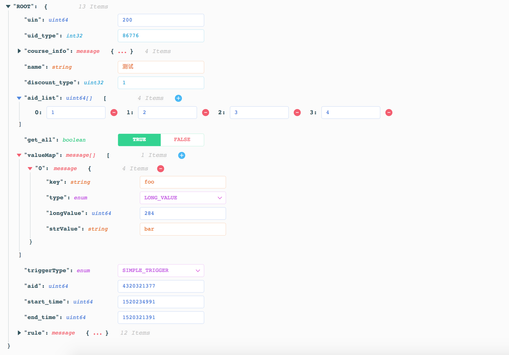

# TreeInput
A TreeInput Component for React

## Features
* Using schema to generate complex nested forms easily
* Stringify all kinds of types including **64bit numbers**
* Documentation tips
* Filter empty values
* Pretty UI with color schema

## Preview

## Install
`npm i -S tree-input`

## Example
[TreeInput Example](example/src/index.js)

## PropTypes
* **schema: Array** Field infos  

* **rootName: String (Optional)** Displayed name of root node  

* **collapsed: Boolean | Int (Optional)** "True" to collapse all nodes; "False" to expand all nodes, number to expand nodes with the specified nested depth  

* **onChange: Function (Optional)** onChange(event, formatedValue, rawValue)  

* **filterEmpty: Boolean (Optional)** Filter empty values including "null", "undefined", "[]", "{}" and empty string  
